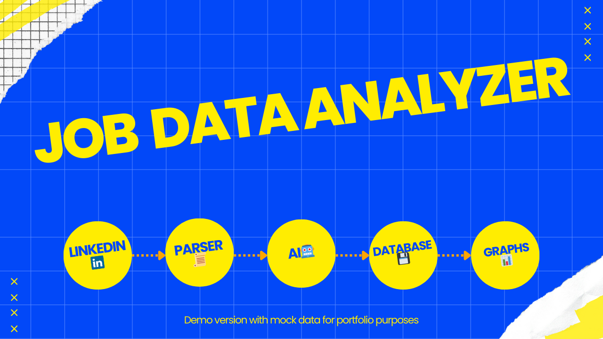

# LinkedIn Job Scraper & AI Vacancy Analyzer


## 📌 Project Overview
This project automates the process of finding and analyzing LinkedIn job postings based on:
- **Country** specified by the user
- **Search query** (e.g., `"Python Developer"`)
- **Number of vacancies** to retrieve

Once the vacancies are collected, the project uses a **locally running AI model (Qwen3-8B)** to extract structured job information from the job descriptions.

Example AI output:
```json
[{
  "job_title": "Lead API Python Developer",
  "company_name": "ADP",
  "location": "Parsippany, NJ",
  "salary": "$77.1K/yr - $206.8K/yr",
  "job_type": null,
  "work_mode": "Remote",
  "soft_skills": [
    "empathetic to client needs",
    "collaboration",
    "problem-solving",
    "communication"
  ],
  "hard_skills": [
    "Python", "SQL", "Java", "AWS Cloud", "Databricks",
    "API Development", "event-driven platforms", "CI/CD", "Jenkins",
    "Terraform", "Splunk", "Dynatrace", "Bitbucket", "JIRA", "Confluence",
    "S3 AWS", "Aurora Postgres", "workflow orchestration", "Temporal"
  ]
}]
```
